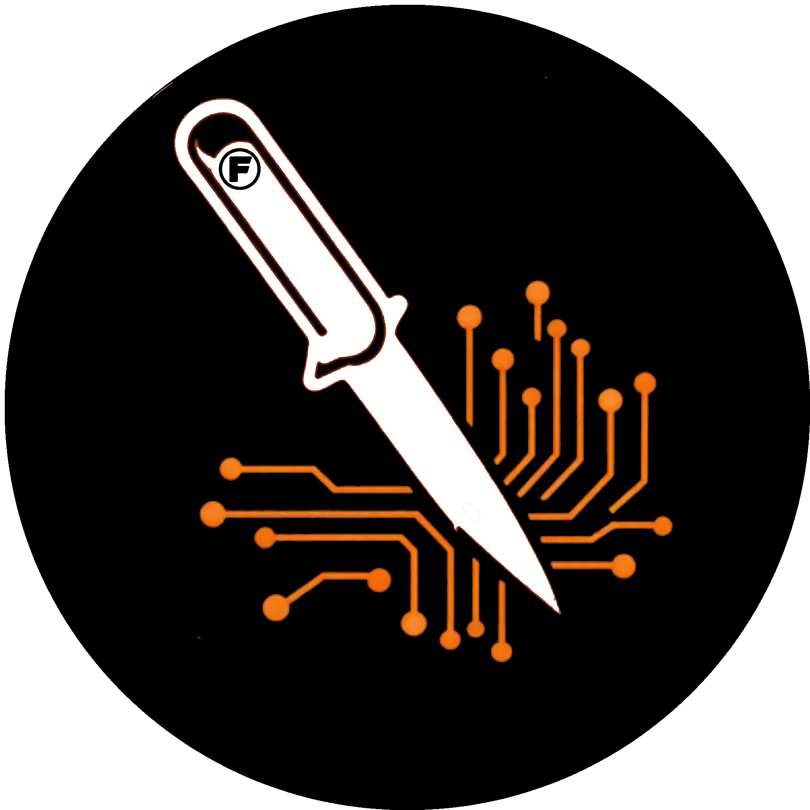

<p align="center">
  
</p>

<h1 align="center">App Surgeon</h1>
<p align="center"><strong>by <a href="https://github.com/FutronPrime">☰ FutЯøn ☰</a> · <a href="https://futronindustries.com">Futron Industries</a></strong></p>

<p align="center">Diagnose, fix, reverse-engineer, customize, and add features to any installed application.</p>

The AI-powered application toolkit that **troubleshoots crashes**, patches compiled code, injects custom UI, modifies configs, and adds functionality — all with proactive web research, self-evolving learning, and rollback safety. Works with Claude Code, OpenClaw, or any LLM-powered coding assistant.

## What It Does

App Surgeon gives your AI coding assistant the ability to:
- **Diagnose & Fix** app crashes, blank screens, freezes, and bugs with proactive research
- **Analyze** any installed app's structure (Electron, Python, native, web)
- **Patch** compiled code to change behavior, branding, or features
- **Inject** custom UI elements into Electron/web apps
- **Override** configs to customize without touching source code
- **Add features** via MCP servers, plugins, or code injection
- **Clone** apps via blackbox reverse engineering (no source code needed)
- **Translate** code between any programming languages locally
- **Rollback** any change safely with automatic backups
- **Learn** from every fix — builds a self-evolving knowledge base of solutions

## Key Features

### Proactive Troubleshooting (NEW)
When an app is broken, App Surgeon doesn't wait for you to find the fix. It:
1. **Captures crash logs, console output, and process state** automatically
2. **Searches the web** — forums, GitHub Issues, Stack Overflow, Reddit, YouTube
3. **Ranks solutions** by community confirmation count (most-confirmed first)
4. **Applies fixes in escalating order** — config → environment → data → reset → workaround
5. **Makes fixes permanent** — launcher scripts, plist flags, config files
6. **Documents everything** so the fix is never rediscovered

### Self-Evolving Learning System (NEW)
App Surgeon gets smarter over time:
- **Known Fixes Database** — every successful fix is recorded with symptoms, root cause, and solution
- **App Profiles** — proactively scans installed apps to build context before issues arise
- **Pattern Recognition** — if the same fix works across multiple apps, it becomes a general rule
- **Platform Knowledge** — learns macOS version quirks, architecture issues, Electron bugs
- **Memory Integration** — persists across sessions via claude-mem and local memory files

### Proactive Web Research
App Surgeon searches like a human would:
```
Official forums → GitHub Issues → Stack Overflow → Reddit → YouTube → X/Twitter
```
It ranks solutions by confirmation count and applies the most-confirmed fix first. **You never have to google fixes yourself.**

## Quick Start

### As a Claude Code Skill
```bash
# Copy the skill to your Claude Code skills directory
cp -r skills/app-surgeon ~/.claude/skills/

# Fix a broken app
# In Claude Code: /app-surgeon fix Obsidian

# Customize an app
# In Claude Code: /app-surgeon Spotify

# Analyze an app
# In Claude Code: /app-surgeon analyze Discord
```

### Commands
```
/app-surgeon fix <app-name>       # Diagnose & fix crashes/bugs
/app-surgeon <app-name>           # Full surgery workflow (customize/modify)
/app-surgeon analyze <app-name>   # Recon only
/app-surgeon clone <app-name>     # Blackbox clone/rebuild
/app-surgeon rollback <app-name>  # Restore from backup
/app-surgeon scan-apps            # Proactively profile all installed apps
/app-surgeon install-tools        # Install CLI toolbox
```

### As an MCP Server (works with any MCP client)
```bash
# Install dependencies
pip install mcp

# Run the code translator server
python servers/code-translate-server.py

# Or run the app analysis server
python servers/app-analysis-server.py
```

### As a Standalone CLI
```bash
# Translate Python to Rust
python tools/code-translate.py --cli -s input.py -l rust

# Translate English description to code
python tools/code-translate.py --cli -s idea.txt -l python --allfile
```

## Troubleshooting Workflow

When invoked with `fix`, App Surgeon follows this escalating cascade:

```
Level 1: CONFIG FIXES (zero risk)
├── Disable community plugins / extensions
├── Reset workspace/window state files
├── Set Electron flags (--disable-gpu, --no-sandbox)
├── Clear app caches
└── Remove stale update files

Level 2: ENVIRONMENT FIXES (low risk)
├── Force Rosetta mode for ARM64 issues
├── Update/downgrade app version
├── Fix file permissions
└── Remove problematic symlinks

Level 3: DATA FIXES (moderate risk)
├── Reduce data volume
├── Create lightweight proxy vaults/configs
├── Remove corrupted data files
└── Rebuild indexes/databases

Level 4: RESET (backup first)
├── Reset app config folder
├── Delete Application Support data
└── Fresh reinstall

Level 5: WORKAROUNDS
├── Run under Rosetta permanently
├── Pin to older working version
├── Create launcher script with special flags
└── File upstream bug report
```

## Known Fixes Database

| App | Issue | Platform | Fix |
|-----|-------|----------|-----|
| Obsidian 1.12.7 | Blank screen after indexing | macOS 26.4 ARM64 | Rosetta + `--disable-gpu` + proxy vault |
| Electron apps | Blank/black window | macOS 26+ | `--disable-gpu` in `user-flags.json` |
| Electron apps | Stale update crash loop | any | Delete `<app>-*.asar` from Application Support |
| Obsidian | Plugin causes crash | any | `echo '[]' > .obsidian/community-plugins.json` |

*This table grows automatically as App Surgeon fixes more apps.*

## Architecture

```
app-surgeon/
├── skills/
│   └── app-surgeon/
│       └── SKILL.md          # Claude Code skill (troubleshooting + surgery + learning)
├── servers/
│   ├── code-translate-server.py  # MCP server: code translation
│   └── app-analysis-server.py    # MCP server: app recon & analysis
├── tools/
│   ├── code-translate.py     # Standalone CLI translator
│   └── app-patcher.py        # Code patching utilities
├── connectors/
│   ├── ollama.py             # Local Ollama connector (default)
│   ├── openai_compat.py      # OpenAI-compatible API connector
│   └── anthropic.py          # Anthropic API connector
└── README.md
```

## Supported App Types

| App Type | Analysis | Fixing | Code Patching | UI Injection | Config Override |
|----------|----------|--------|---------------|--------------|-----------------|
| Electron (React/Vue/Svelte) | Full | Full | Yes (main.cjs) | Yes (webContents) | Yes |
| Python (Flask/Django/CLI) | Full | Full | Yes (direct) | Yes (templates) | Yes |
| Node.js (Express/Next.js) | Full | Full | Yes (direct) | Yes (templates) | Yes |
| Native macOS (Swift) | Partial | Partial | No (binary) | No | Yes (plists/configs) |
| Web Apps (browser) | Full | Partial | Via extension | Via userscript | Via extension |

## LLM Provider Configuration

App Surgeon is **LLM-agnostic**. Configure via environment variables:

```bash
# Local Ollama (default, zero cost)
export CODE_TRANSLATE_PROVIDER=ollama
export OLLAMA_URL=http://127.0.0.1:11434
export CODE_TRANSLATE_MODEL=llama3.1

# OpenAI
export CODE_TRANSLATE_PROVIDER=openai
export CODE_TRANSLATE_API_KEY=sk-...
export CODE_TRANSLATE_MODEL=gpt-4o

# Anthropic (via OpenAI-compatible proxy)
export CODE_TRANSLATE_PROVIDER=openai-compatible
export OPENAI_BASE_URL=https://api.anthropic.com/v1
export CODE_TRANSLATE_API_KEY=sk-ant-...
export CODE_TRANSLATE_MODEL=claude-sonnet-4-20250514

# Any OpenAI-compatible endpoint (OpenRouter, Together, Groq, etc.)
export CODE_TRANSLATE_PROVIDER=openai-compatible
export OPENAI_BASE_URL=https://openrouter.ai/api/v1
export CODE_TRANSLATE_API_KEY=sk-or-...
export CODE_TRANSLATE_MODEL=meta-llama/llama-3.1-70b
```

## Code Translation

Translate between **30+ programming languages** locally:

```bash
# Python to Rust
python tools/code-translate.py --cli -s app.py -l rust

# JavaScript to Go
python tools/code-translate.py --cli -s server.js -l go

# English to Python (natural language to code)
echo "A web server that serves files from ./public on port 8080" > idea.txt
python tools/code-translate.py --cli -s idea.txt -l python --allfile
```

## Blackbox Reverse Engineering

When you don't have source code:

```
1. OBSERVE  — Screenshot every screen, capture network traffic
2. SPECIFY  — AI generates specs from observations
3. REBUILD  — Generate new app from specs
4. VALIDATE — Visual comparison + functional parity testing
```

## Open Source Toolbox

App Surgeon integrates with these tools:
- **[aiTrans](https://github.com/ortegaalfredo/aiTrans)** — CLI source-to-source transpiler
- **[Dyad](https://github.com/dyad-sh/dyad)** — Local AI app builder
- **[AI Website Cloner](https://github.com/JCodesMore/ai-website-cloner-template)** — Clone website UIs
- **[ReverserAI](https://github.com/mrphrazer/reverser_ai)** — Binary reverse engineering with local LLMs
- **[AI Code Translator](https://github.com/mckaywrigley/ai-code-translator)** — Cross-language translation UI

## Safety

- **Automatic backups** before every modification
- **Escalating fix cascade** — least destructive first
- **Proactive research** — searches for confirmed solutions before trying random fixes
- **Rollback** with a single command
- **Verification** step after every patch
- **No destructive operations** without explicit confirmation
- **Memory persistence** — fixes are never rediscovered from scratch

## Contributing

PRs welcome! See [CONTRIBUTING.md](CONTRIBUTING.md) for guidelines.

## License

Apache 2.0 — use it however you want.

---

Built by [☰ FutЯøn ☰](https://github.com/FutronPrime) | [Futron Industries](https://futronindustries.com)
