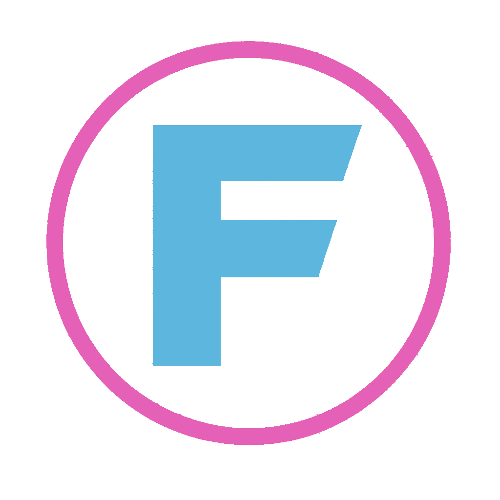

<p align="center">
  
</p>

<h1 align="center">App Surgeon</h1>
<p align="center"><strong>by FUTRON Prime</strong></p>

<p align="center">Reverse-engineer, customize, and add features to any installed application.</p>

Patches compiled code, injects custom UI, modifies configs, and adds functionality — all with rollback safety. Works with Claude Code, OpenClaw, or any LLM-powered coding assistant.

## What It Does

App Surgeon gives your AI coding assistant the ability to:
- **Analyze** any installed app's structure (Electron, Python, native, web)
- **Patch** compiled code to change behavior, branding, or features
- **Inject** custom UI elements into Electron/web apps
- **Override** configs to customize without touching source code
- **Add features** via MCP servers, plugins, or code injection
- **Clone** apps via blackbox reverse engineering (no source code needed)
- **Translate** code between any programming languages locally
- **Rollback** any change safely with automatic backups

## Quick Start

### As a Claude Code Skill
```bash
# Copy the skill to your Claude Code skills directory
cp -r skills/app-surgeon ~/.claude/skills/

# Use it
# In Claude Code, type: /app-surgeon <app-name>
```

### As an MCP Server (works with any MCP client)
```bash
# Install dependencies
pip install mcp

# Run the code translator server
python servers/code-translate-server.py

# Or run the app analysis server
python servers/app-analysis-server.py
```

### As a Standalone CLI
```bash
# Translate Python to Rust
python tools/code-translate.py --cli -s input.py -l rust

# Translate English description to code
python tools/code-translate.py --cli -s idea.txt -l python --allfile
```

## Architecture

```
app-surgeon/
├── skills/
│   └── app-surgeon/
│       └── SKILL.md          # Claude Code skill definition
├── servers/
│   ├── code-translate-server.py  # MCP server: code translation
│   └── app-analysis-server.py    # MCP server: app recon & analysis
├── tools/
│   ├── code-translate.py     # Standalone CLI translator
│   └── app-patcher.py        # Code patching utilities
├── connectors/
│   ├── ollama.py             # Local Ollama connector (default)
│   ├── openai_compat.py      # OpenAI-compatible API connector
│   └── anthropic.py          # Anthropic API connector
├── examples/
│   ├── electron-rebrand/     # Example: rebrand an Electron app
│   ├── add-tts-toggle/       # Example: inject TTS provider toggle
│   └── personality-patch/    # Example: replace AI assistant persona
└── README.md
```

## LLM Provider Configuration

App Surgeon is **LLM-agnostic**. Configure via environment variables:

```bash
# Local Ollama (default, zero cost)
export CODE_TRANSLATE_PROVIDER=ollama
export OLLAMA_URL=http://127.0.0.1:11434
export CODE_TRANSLATE_MODEL=llama3.1

# OpenAI
export CODE_TRANSLATE_PROVIDER=openai
export CODE_TRANSLATE_API_KEY=sk-...
export CODE_TRANSLATE_MODEL=gpt-4o

# Anthropic (via OpenAI-compatible proxy)
export CODE_TRANSLATE_PROVIDER=openai-compatible
export OPENAI_BASE_URL=https://api.anthropic.com/v1
export CODE_TRANSLATE_API_KEY=sk-ant-...
export CODE_TRANSLATE_MODEL=claude-sonnet-4-20250514

# Any OpenAI-compatible endpoint (OpenRouter, Together, Groq, etc.)
export CODE_TRANSLATE_PROVIDER=openai-compatible
export OPENAI_BASE_URL=https://openrouter.ai/api/v1
export CODE_TRANSLATE_API_KEY=sk-or-...
export CODE_TRANSLATE_MODEL=meta-llama/llama-3.1-70b
```

## Supported App Types

| App Type | Analysis | Code Patching | UI Injection | Config Override |
|----------|----------|---------------|--------------|-----------------|
| Electron (React/Vue/Svelte) | Full | Yes (main.cjs) | Yes (webContents) | Yes |
| Python (Flask/Django/CLI) | Full | Yes (direct) | Yes (templates) | Yes |
| Node.js (Express/Next.js) | Full | Yes (direct) | Yes (templates) | Yes |
| Native macOS (Swift) | Partial | No (binary) | No | Yes (plists/configs) |
| Web Apps (browser) | Full | Via extension | Via userscript | Via extension |

## Code Translation

Translate between **30+ programming languages** locally:

```bash
# Python → Rust
python tools/code-translate.py --cli -s app.py -l rust

# JavaScript → Go
python tools/code-translate.py --cli -s server.js -l go

# English → Python (natural language to code)
echo "A web server that serves files from ./public on port 8080" > idea.txt
python tools/code-translate.py --cli -s idea.txt -l python --allfile
```

Supported: Python, JavaScript, TypeScript, Rust, Go, Java, C, C++, C#, Ruby, PHP, Swift, Kotlin, Scala, R, Bash, PowerShell, SQL, HTML, CSS, Lua, Perl, Haskell, Elixir, Dart, and more.

## Blackbox Reverse Engineering

When you don't have source code:

```
1. OBSERVE  — Screenshot every screen, capture network traffic
2. SPECIFY  — AI generates specs from observations
3. REBUILD  — Generate new app from specs
4. VALIDATE — Visual comparison + functional parity testing
```

## Open Source Toolbox

App Surgeon integrates with these tools:
- **[aiTrans](https://github.com/ortegaalfredo/aiTrans)** — CLI source-to-source transpiler
- **[Dyad](https://github.com/dyad-sh/dyad)** — Local AI app builder
- **[AI Website Cloner](https://github.com/JCodesMore/ai-website-cloner-template)** — Clone website UIs
- **[ReverserAI](https://github.com/mrphrazer/reverser_ai)** — Binary reverse engineering with local LLMs
- **[AI Code Translator](https://github.com/mckaywrigley/ai-code-translator)** — Cross-language translation UI

## Examples

### Rebrand an Electron App
```python
# Replace "App Name" with "My Custom App" in compiled code
python tools/app-patcher.py \
  --app "/Applications/SomeApp.app" \
  --find "Original App Name" \
  --replace "My Custom App"
```

### Inject a Custom UI Widget
```python
# Add a floating settings toggle to any Electron app
python tools/app-patcher.py \
  --app "/Applications/SomeApp.app" \
  --inject-ui "examples/add-tts-toggle/widget.js"
```

### Translate an Entire Codebase
```bash
# Translate all Python files in a project to Rust
find ./src -name "*.py" -exec \
  python tools/code-translate.py --cli -s {} -l rust -o {}.rs \;
```

## Safety

- **Automatic backups** before every modification
- **Rollback** with a single command
- **Verification** step after every patch
- **No destructive operations** without explicit confirmation

## Contributing

PRs welcome! See [CONTRIBUTING.md](CONTRIBUTING.md) for guidelines.

## License

Apache 2.0 — use it however you want.

---

Built by [FUTRON Prime](https://github.com/futron-prime) | Powered by open-source AI
